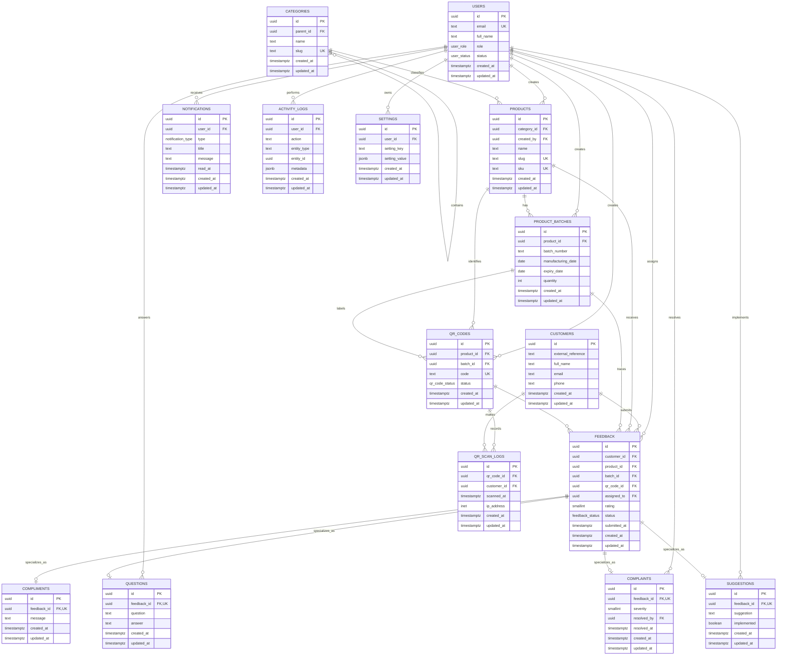

# MilletsNow Database ER Diagram

PostgreSQL entity relationship diagram for the Phase 2 database foundation.

`questions`, `compliments`, `complaints`, and `suggestions` are one-to-zero-or-one feedback subtypes through their unique `feedback_id` foreign keys. All tables use UUID primary keys and automatic `updated_at` triggers.
